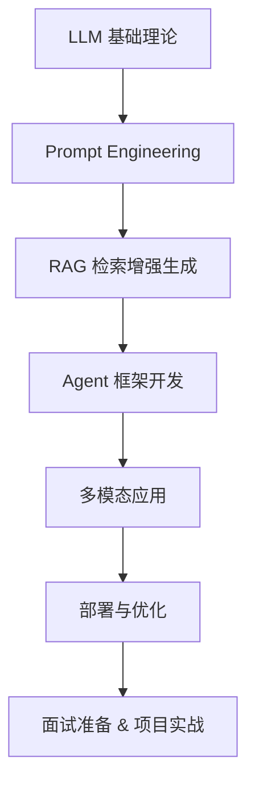

# 🌏 Awesome Agent Development Roadmap

> 🎯 From zero to building your own AI-powered applications — a complete learning roadmap for **Agent Application Development**.  
> 📚 汇总大模型应用（Agent）开发的学习路线、资料、工具、开源项目与面试准备指南，帮助你系统掌握从入门到落地的全流程。

---

## 🧭 目录

---

## 🚀 学习路线总览

保姆级学习路线（持续更新，跟着学就够了）：  
- [Agent开发保姆级学习路线(知乎)](https://www.zhihu.com/question/1936375725931361485/answer/2010135875586114494)
- [Agent开发保姆级学习路线(公众号)](https://mp.weixin.qq.com/s/SJC7Ok_jcatfyWtzfaKFDw)



## 🧩 学习教程

### 体系化学习课程

- [Agentic_ai系列课程_吴恩达老师](https://github.com/datawhalechina/agentic-ai)
- [Hello Agents_DataWhale社区](https://datawhalechina.github.io/hello-agents/)
- [All in Rag_DataWhale社区](https://datawhalechina.github.io/all-in-rag/)
- [大模型应用开发_DataWhale社区](https://github.com/datawhalechina/llm-universe)
- [ai-agents-for-beginners_微软](https://github.com/microsoft/ai-agents-for-beginners)
- [learn-claude-code-A nano claude code–like 「agent harness」, built from 0 to 1](https://github.com/shareAI-lab/learn-claude-code/tree/main)

### 经典书籍

- [Google agent白皮书](https://github.com/summerjava/LLM-App-Dev-4CRUDer/blob/main/%E5%A4%A7%E6%A8%A1%E5%9E%8B%E5%BA%94%E7%94%A8%E5%BC%80%E5%8F%91-%E5%AD%A6%E4%B9%A0%E8%B5%84%E6%96%99/Google%20Agent%E7%99%BD%E7%9A%AE%E4%B9%A6.pdf)
- [Google agent白皮书中文版](https://github.com/summerjava/LLM-App-Dev-4CRUDer/blob/main/%E5%A4%A7%E6%A8%A1%E5%9E%8B%E5%BA%94%E7%94%A8%E5%BC%80%E5%8F%91-%E5%AD%A6%E4%B9%A0%E8%B5%84%E6%96%99/%5B%E8%AF%91%5D%20AI%20Agent%EF%BC%88%E6%99%BA%E8%83%BD%E4%BD%93%EF%BC%89%E7%99%BD%E7%9A%AE%E4%B9%A6.pdf)
- [Google Agentic-design-patterns中文版.pdf](https://github.com/summerjava/LLM-App-Dev-4CRUDer/blob/main/%E5%A4%A7%E6%A8%A1%E5%9E%8B%E5%BA%94%E7%94%A8%E5%BC%80%E5%8F%91-%E5%AD%A6%E4%B9%A0%E8%B5%84%E6%96%99/agentic-design-patterns-zh-20251011.pdf)
- [Google白皮书-Agent Quality](https://github.com/summerjava/LLM-App-Dev-4CRUDer/blob/main/%E5%A4%A7%E6%A8%A1%E5%9E%8B%E5%BA%94%E7%94%A8%E5%BC%80%E5%8F%91-%E5%AD%A6%E4%B9%A0%E8%B5%84%E6%96%99/Google%205%E6%9C%AC%20%E7%99%BD%E7%9A%AE%E4%B9%A6/Agent%20Quality.pdf)
- [Google白皮书-Agent Tools & Interoperability with Model Context Protocol (MCP)](https://github.com/summerjava/LLM-App-Dev-4CRUDer/blob/main/%E5%A4%A7%E6%A8%A1%E5%9E%8B%E5%BA%94%E7%94%A8%E5%BC%80%E5%8F%91-%E5%AD%A6%E4%B9%A0%E8%B5%84%E6%96%99/Google%205%E6%9C%AC%20%E7%99%BD%E7%9A%AE%E4%B9%A6/Agent%20Tools%20%26%20Interoperability%20with%20Model%20Context%20Protocol%20(MCP).pdf)
- [Google白皮书-Context Engineering_ Sessions & Memory.pdf](https://github.com/summerjava/LLM-App-Dev-4CRUDer/blob/main/%E5%A4%A7%E6%A8%A1%E5%9E%8B%E5%BA%94%E7%94%A8%E5%BC%80%E5%8F%91-%E5%AD%A6%E4%B9%A0%E8%B5%84%E6%96%99/Google%205%E6%9C%AC%20%E7%99%BD%E7%9A%AE%E4%B9%A6/Context%20Engineering_%20Sessions%20%26%20Memory.pdf)
- [Google白皮书-Introduction to Agents.pdf](https://github.com/summerjava/LLM-App-Dev-4CRUDer/blob/main/%E5%A4%A7%E6%A8%A1%E5%9E%8B%E5%BA%94%E7%94%A8%E5%BC%80%E5%8F%91-%E5%AD%A6%E4%B9%A0%E8%B5%84%E6%96%99/Google%205%E6%9C%AC%20%E7%99%BD%E7%9A%AE%E4%B9%A6/Introduction%20to%20Agents.pdf)
- [Google白皮书-Prototype to Production.pdf](https://github.com/summerjava/LLM-App-Dev-4CRUDer/blob/main/%E5%A4%A7%E6%A8%A1%E5%9E%8B%E5%BA%94%E7%94%A8%E5%BC%80%E5%8F%91-%E5%AD%A6%E4%B9%A0%E8%B5%84%E6%96%99/Google%205%E6%9C%AC%20%E7%99%BD%E7%9A%AE%E4%B9%A6/Prototype%20to%20Production.pdf)

### 经典博客文章
- [building-effective-agents_Anthropic](https://www.anthropic.com/engineering/building-effective-agents)

### 入门-Prompt提示词工程

- [Calude文档-提示词工程](platform.claude.com/docs/en/build-with-claude/prompt-engineering/overview)
- [Anthropic's Interactive Prompt Engineering Tutorial](https://github.com/anthropics/prompt-eng-interactive-tutorial)
- [吴恩达-chatgpt-prompt-engineering-for-developers/](https://www.deeplearning.ai/short-courses/chatgpt-prompt-engineering-for-developers/)
- [高效提示词（prompt）工程指南_ByteByteGo](https://blog.bytebytego.com/p/a-guide-to-effective-prompt-engineering)
- [高效提示词（prompt）工程指南中文版_ByteByteGo](https://zhuanlan.zhihu.com/p/2008874707131340174)

### Python& FastAPI

- [fastapi](https://github.com/tiangolo/fastapi)

### 进阶-框架

- [LangChain](https://github.com/langchain-ai/langchain)
- [langGraph](https://github.com/langchain-ai/langgraph)
- [llama_index](https://github.com/run-llama/llama_index)
- [AutoGen](https://github.com/microsoft/autogen)
- [CrewAI](https://github.com/crewaiinc/crewai)
- [MetaGPT](https://github.com/FoundationAgents/MetaGPT)

### RAG&向量数据库


- [zilliz-深度干货|万字长文解读向量数据库的前世今生（先码后学）](https://zilliz.com.cn/blog/Deep-Dive-Into-Vector-Databases)
- [chroma](https://github.com/chroma-core/chroma)
- [Pinecone](https://www.pinecone.io/)
- [faiss](https://github.com/facebookresearch/faiss)

### Agent架构实现/实战

- [17+ agentic架构代码实现](https://github.com/FareedKhan-dev/all-agentic-architectures/tree/main)

### Skills
Skills教程

- [从零开始玩转OpenClaw](https://github.com/xianyu110/awesome-openclaw-tutorial)
- [OAnthropic官方Skills](https://github.com/anthropics/skills)
- [Superpowers](https://github.com/obra/superpowers)
- [Planning-with-files](https://github.com/OthmanAdi/planning-with-files)

Skills资源

- [awesome-openclaw-skills](https://github.com/VoltAgent/awesome-openclaw-skills)
- [Skills资源-小红书等图片生成](https://github.com/JimLiu/baoyu-skills)

### Agent评估

- [Anthropic万字长文：一篇AI Agent评估体系的详细解析！](https://mp.weixin.qq.com/s/C2Vpvm662STIohvnLQQgIQ)
- [使用 Ragas 进行评估](https://milvus.io/docs/zh/integrate_with_ragas.md)

### Agent可观测性

- [从 AI Agent 到模型推理：端到端 AI 可观测实践](https://zhuanlan.zhihu.com/p/1916169255818358957)
- [OrcaReplay](https://github.com/Continuum-AI-Corp/OrcaReplay)：从「能观测」走到「能复现」——在模型 provider 边界把一次 agent 运行的真实字节流（prompt、工具调用、响应）录成本地 trace，事后 `orca replay last` 可断网、不花 token 地按字节重放同一次运行，`orca compare` 则能从任意 checkpoint 换模型重跑做对照；Apache-2.0 的 Node CLI，不需要改 agent 代码。

### Vibe-Coding

- [成为真正的AI Native Coder，一个研究生实践6个月的思考！](https://mp.weixin.qq.com/s/xLgonEJ9cCH0LaLpw76_3g)
- [首个系统化 Vibe Coding 开源教程](https://github.com/datawhalechina/vibe-vibe)
- [Spec-Driven Development with Claude Code](https://agentfactory.panaversity.org/docs/General-Agents-Foundations/spec-driven-development)

## 🧰 经典入门案例

- [50行Python代码实现Rag应用](https://github.com/summerjava/LLM-App-Dev-4CRUDer/tree/main/%E5%A4%A7%E6%A8%A1%E5%9E%8B%E5%BA%94%E7%94%A8%E5%BC%80%E5%8F%91-%E7%BB%8F%E5%85%B8%E5%85%A5%E9%97%A8%E6%A1%88%E4%BE%8B/50%E8%A1%8CPython%E4%BB%A3%E7%A0%81%E5%AE%9E%E7%8E%B0Rag%E5%BA%94%E7%94%A8)

## 🎯 职业发展  

- [AI时代的技术抉择：后端开发 vs. 大模型应用开发](https://github.com/summerjava/LLM-App-Dev-4CRUDer/blob/main/%E9%9D%A2%E8%AF%95%E4%B8%8E%E8%81%8C%E4%B8%9A%E5%8F%91%E5%B1%95/AI%E6%97%B6%E4%BB%A3%E7%9A%84%E6%8A%80%E6%9C%AF%E6%8A%89%E6%8B%A9%EF%BC%9A%E5%90%8E%E7%AB%AF%E5%BC%80%E5%8F%91%20vs.%20%E5%A4%A7%E6%A8%A1%E5%9E%8B%E5%BA%94%E7%94%A8%E5%BC%80%E5%8F%91.md)
- [计算机专业想做大模型应用开发，该如何规划](https://github.com/summerjava/LLM-App-Dev-4CRUDer/blob/main/%E9%9D%A2%E8%AF%95%E4%B8%8E%E8%81%8C%E4%B8%9A%E5%8F%91%E5%B1%95/%E8%AE%A1%E7%AE%97%E6%9C%BA%E4%B8%93%E4%B8%9A%E6%83%B3%E5%81%9A%E5%A4%A7%E6%A8%A1%E5%9E%8B%E5%BA%94%E7%94%A8%E5%BC%80%E5%8F%91%EF%BC%8C%E8%AF%A5%E5%A6%82%E4%BD%95%E8%A7%84%E5%88%92.md)

## 可以写在简历的企业级项目  
企业级项目，有亮点、差异化。   
什么样的项目才算企业级的项目？能写在简历上给面试官眼前一亮的感觉？

```
好的AI Agent工程师要做到：  
- 了解大模型的基本原理(能运用、调优、诊断大模型问题)，
- 知道怎么搭建Al Agent(从让Agent 做规划决策一>调用外部API和函数一>具有记忆一>如何监控Agent的性能)，
- 能独立完成一个中等复杂度Web服务从开发、测试到部署、监控的全流程。

- 关注如何处理模糊语义/做路由/反问获取精准问题/做适合于输入的知识管理，
- 如何处理多轮对话和记忆，
- 如何处理并发/长时延/兜底策略，
- 如何做提示词/Agent的版本管理,
- 如何兼容不同模型，
- 如何评估评测Agent，效果相比之前版本有多大改善等等等。
```

有需要一对一Agent开发简历修改的朋友可以从后面的WX二维码找我。

## 🎯 面试


## 优秀开源项目

### 优质Agent开源项目

- [OpenManus](https://github.com/FoundationAgents/OpenManus)
- OpenCode：[Opencode官方文档](https://opencode.ai/docs/zh-cn/)、[OpenCode中文实战课](https://learnopencode.com/)

### RAG相关

- [TrustRAG](https://github.com/gomate-community/TrustRAG)

### OpenClaw小龙虾🦞

- [如何一键部署并使用云端OpenClaw](https://www.zhihu.com/question/2009611085918013365/answer/2011563780694365542)
- [阿里云-部署OpenClaw（原Moltbot、Clawdbot）镜像](https://help.aliyun.com/zh/simple-application-server/use-cases/quickly-deploy-and-use-openclaw?spm=a2c4g.11186623.0.i3)
- [Youtube视频-OpenClaw Full Tutorial for Beginners – How to Set Up and Use OpenClaw (ClawdBot / MoltBot)](https://www.youtube.com/watch?v=n1sfrc-RjyM)

## Agent开发工业界落地案例

- [基于AI大模型的故障诊断与根因分析落地实现](https://mp.weixin.qq.com/s/AYenvVpB-oHWabJFbkUpmg)

## 热门AI工具

- [开源项目阅读利器-DeepWiki](https://deepwiki.com/)

### Claude Code

- [Claude官方文档-Agent SDK](https://platform.claude.com/docs/en/agent-sdk/overview)
- [Claude Code最佳实践-github](https://github.com/shanraisshan/claude-code-best-practice)
- [一小时教程-教你如何从零开始构建并自动化各种项目](https://mp.weixin.qq.com/s?__biz=MzIyNjM2MzQyNg==&mid=2247721554&idx=1&sn=581eff5b5c6ee6f745928b82b6cd147b&chksm=e9f5740704f010ed3ee737d1bcb70782887a192011a7d9c30a97f5247e5c377fb4af2c42d4ed&mpshare=1&scene=24&srcid=0404CvlLEqOyoPhA2frQ9294&sharer_shareinfo=f5edd634529c275beb6d18a18a321342&sharer_shareinfo_first=f5edd634529c275beb6d18a18a321342#rd)

### SeeDance 2.0

- [🎬 即梦 Seedance 2.0 使用手册（全新多模态创作体验）](https://bytedance.larkoffice.com/wiki/A5RHwWhoBiOnjukIIw6cu5ybnXQ)

### Nano Banana

- [Nano Banana 图片生成-Google官方文档](https://ai.google.dev/gemini-api/docs/image-generation?hl=zh-cn)
- [Nano Banana 超完整攻略：一篇搞懂 Google 殺手級 AI 繪圖](https://blog.creatorhome.tw/nano-banana/)

## 优质专栏课程

**如果需要一对一的大模型应用开发（AI Agent开发）的学习路线规划、项目带做、简历修改、面试辅导可以联系我哦：【meta1101】**  

辅导案例：


## 📈 贡献与社区

欢迎贡献资源、学习路线或开源项目链接！  
请提交 PR 或在 Issues 中推荐你认为值得加入的内容 🙌

## Star History

[](https://www.star-history.com/#summerjava/Awesome_Agent_Dev&type=date&legend=top-left)
